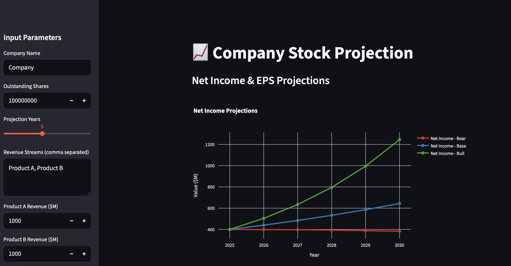

# Stock Simulator

A Streamlit web application for projecting stock prices based on revenue growth scenarios and financial metrics.



## Features

- Interactive stock projection simulation
- Multiple revenue stream support
- Bear, base, and bull case scenarios
- Dynamic financial modeling
- Interactive charts and visualizations
- Real-time parameter adjustment

## Installation

### Development Installation

To install the package in development mode with all dependencies:

```bash
pip install -e .
```

### Alternative Installation

You can also install dependencies directly:

```bash
pip install -r requirements.txt
```

## Usage

Run the Streamlit application:

```bash
streamlit run stock_simulator.py
```

## Dependencies

- **streamlit**: Web application framework
- **numpy**: Numerical computing
- **pandas**: Data manipulation and analysis
- **plotly**: Interactive plotting and visualization

## Development

For development dependencies:

```bash
pip install -e .[dev]
```

This includes:
- pytest: Testing framework
- black: Code formatting
- flake8: Linting

## License

MIT License
